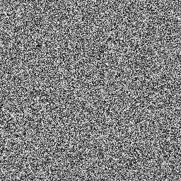

# 🐒 louis030195.com

### 👋 Favourite daily quotes from [readwise.io/@louis](https://readwise.io/@louis)

          In the terminology of game theory, most interesting international conflicts are not “constant-sum games” but “variable-sum games”: the sum of the gains of the participants involved is not fixed so that more for one inexorably means less for the other.
        

The Strategy of Conflict

Thomas C. Schelling

          Making things is a joy—immensely satisfying. J. R. R. Tolkien suggests that God gave us the gift of subcreation, as a gift, just for our joy.2 After all, “The cattle on a thousand hills are mine. … If I were hungry, I would not tell you.”3 Designing per se is fun.
        

Frederick P. Brooks - The Design of Design_ Essays From a Computer Scientist-Addison-Wesley Professional

2010

          If you do not undertake a risk of real harm, reparable or even potentially irreparable, from an adventure, it is not an adventure.
        

Skin_In_The_Game

louis.beaumont@gmail.com

### 🧠 Latest changes on [brain.louis030195.com](https://brain.louis030195.com)

    
    

        
            <ul>
                    <li><a href="https://brain.louis030195.com/Computing/Intelligence/Fine tuning OpenAI vulgarized to non-technical.md">Computing/Intelligence/Fine tuning OpenAI vulgarized to non-technical.md</a></li>
            </ul>
        
        

            

                
brain upload 2021-10-22 18:38:33

            

        

    

    

    

        
            <ul>
                    <li><a href="https://brain.louis030195.com/Computing/Intelligence/Fine tuning OpenAI vulgarized to non-technical.md">Computing/Intelligence/Fine tuning OpenAI vulgarized to non-technical.md</a></li>
            </ul>
        
        

            

                
brain upload 2021-10-22 17:38:32

            

        

    

    

    

        
            <ul>
                    <li><a href="https://brain.louis030195.com/Biology/Transhumanism/Health/Bacopa monniera.md">Biology/Transhumanism/Health/Bacopa monniera.md</a></li>
                    <li><a href="https://brain.louis030195.com/Biology/Transhumanism/Health/Creatine.md">Biology/Transhumanism/Health/Creatine.md</a></li>
                    <li><a href="https://brain.louis030195.com/Biology/Transhumanism/Health/L-theanine.md">Biology/Transhumanism/Health/L-theanine.md</a></li>
                    <li><a href="https://brain.louis030195.com/Biology/Transhumanism/Health/Nootropics.md">Biology/Transhumanism/Health/Nootropics.md</a></li>
                    <li><a href="https://brain.louis030195.com/Biology/Transhumanism/Health/Rhodiola Rosea.md">Biology/Transhumanism/Health/Rhodiola Rosea.md</a></li>
            </ul>
        
        

            

                
brain upload 2021-10-22 16:38:30

            

        

    

    

    

        
            <ul>
                    <li><a href="https://brain.louis030195.com/Biology/Transhumanism/Insect agriculture nuclear factory alike.md">Biology/Transhumanism/Insect agriculture nuclear factory alike.md</a></li>
                    <li><a href="https://brain.louis030195.com/Business/Co-restaurant.md">Business/Co-restaurant.md</a></li>
                    <li><a href="https://brain.louis030195.com/Business/Entrepreneurship/Execution is more important than ideas.md">Business/Entrepreneurship/Execution is more important than ideas.md</a></li>
                    <li><a href="https://brain.louis030195.com/Computing/Cryptocurrency are to energy what avocado are to water.md">Computing/Cryptocurrency are to energy what avocado are to water.md</a></li>
            </ul>
        
        

            

                
brain upload 2021-10-22 15:38:28

            

        

    

    

#### 🤔

Hi, I'm Louis, I do a lot of software bricolage,
[book reading](https://www.goodreads.com/user/show/103091881-louis-beaumont),
writing and thinking.
I enjoy learning every day about philosophy, fundamental sciences, compound knowledge, transhumanism and everything around software 2.0, "AI".

- General activities automatically updated - [louis030195.com](https://louis030195.com)
- My second brain - [brain.louis030195.com](https://brain.louis030195.com)

Now, I am founder/co-founder of:
- [langa.me](https://langa.me)
- [inkdrop.ai](https://www.linkedin.com/company/inkdrop-ai/)

<link href="https://assets.calendly.com/assets/external/widget.css" rel="stylesheet">

#### 📚 What I'm currently reading

-   **Walter Isaacson**  - [Einstein: His Life and Universe](https://www.goodreads.com/book/show/10884.Einstein) - Wed Oct 20 00:50:50 -0700 2021
-   **Adam Smith**  - [An Inquiry into the Nature and Causes of the Wealth of Nations](https://www.goodreads.com/book/show/25698.An_Inquiry_into_the_Nature_and_Causes_of_the_Wealth_of_Nations) - Fri Oct 08 00:12:02 -0700 2021
-   **Immanuel Kant**  - [The Critique of Practical Reason](https://www.goodreads.com/book/show/18925384-the-critique-of-practical-reason) - Fri Sep 17 11:31:16 -0700 2021
-   **Bertrand Russell**  - [The Principles of Mathematics](https://www.goodreads.com/book/show/51785.The_Principles_of_Mathematics) - Sat Sep 04 06:13:54 -0700 2021
-   **Bertrand Russell**  - [Introduction to Mathematical Philosophy](https://www.goodreads.com/book/show/31886.Introduction_to_Mathematical_Philosophy) - Sat Sep 04 06:13:27 -0700 2021

#### ✍ My latest Goodreads reviews

-   **Matt Ridley**  - [The Red Queen: Sex and the Evolution of Human Nature](https://www.goodreads.com/book/show/16176.The_Red_Queen) - 5/5 - Wed Oct 20 22:54:35 -0700 2021
-   **Walter Isaacson**  - [Steve Jobs](https://www.goodreads.com/book/show/11084145-steve-jobs) - 5/5 - Wed Oct 20 00:57:43 -0700 2021
-   **Walter Isaacson**  - [Leonardo da Vinci](https://www.goodreads.com/book/show/34684622-leonardo-da-vinci) - 5/5 - Sat Oct 16 03:50:13 -0700 2021
-   **Plutarch**  - [Plutarch&#39;s Lives: Volume I](https://www.goodreads.com/book/show/415634.Plutarch_s_Lives) - 4/5 - Mon Sep 20 06:50:55 -0700 2021
-   **Tim Maudlin**  - [Quantum Non-Locality and Relativity: Metaphysical Intimations of Modern Physics](https://www.goodreads.com/book/show/618011.Quantum_Non_Locality_and_Relativity) - 4/5 - Wed Sep 08 23:48:27 -0700 2021

#### 🗒 Medium posts

- [OpenAI Codex, Rust, TypeScript, Google Cloud, automatic code translation](https://louis030195.medium.com/openai-codex-rust-typescript-google-cloud-automatic-code-translation-8ed723ac1bc3?source=rss-f1c331c9f256------2) - 1 month ago
- [Fine-tuning OpenAI API (GPT3) on your second brain (Obsidian)](https://louis030195.medium.com/fine-tuning-openai-api-gpt3-on-your-second-brain-obsidian-b082afaaeba7?source=rss-f1c331c9f256------2) - 2 months ago
- [What you do not learn at school: how to learn](https://louis030195.medium.com/what-you-do-not-learn-at-school-how-to-learn-d6809922cac?source=rss-f1c331c9f256------2) - 8 months ago
- [The best breakfast is a delightful book](https://louis030195.medium.com/the-best-breakfast-is-a-delightful-book-fa7f6962b202?source=rss-f1c331c9f256------2) - 9 months ago
- [A simulation of evolution — Two](https://louis030195.medium.com/a-simulation-of-evolution-two-b26664d159a5?source=rss-f1c331c9f256------2) - 1 year ago

#### 🎬 Youtube Videos

- [Langame - Squaring the circle](https://www.youtube.com/watch?v=rzfxgOy4x3c) - 1 week ago
- [Quick programming language translation using OpenAI Codex](https://www.youtube.com/watch?v=RUCUxFHtJvw) - 1 month ago
- [Langame - Baldwin Effect](https://www.youtube.com/watch?v=1FGdzDMfLBg) - 1 month ago
- [Langame - Red Queen Effect](https://www.youtube.com/watch?v=wmwRHWftAj8) - 3 months ago
- [Langame - Gains from disorder](https://www.youtube.com/watch?v=URLHBGbsAeI) - 4 months ago

#### 🌱 My latest projects

- [louis030195/gitpod-docker](https://github.com/louis030195/gitpod-docker) - Build some custom docker images to make Gitpod boot faster
- [louis030195/codex-code-translation](https://github.com/louis030195/codex-code-translation) - Automatic code translation using OpenAI Codex
- [louis030195/firebase-data](https://github.com/louis030195/firebase-data) - Easily manage data between Firebase projects.
- [louis030195/book2audiobook](https://github.com/louis030195/book2audiobook) - text to speech public domain / free audio books
- [louis030195/firebase-emulator-chart](https://github.com/louis030195/firebase-emulator-chart) - one-liner deployment of firebase emulator on Kubernetes for development and testing purposes using Helm

#### 🔭 Latest releases I've contributed to

- [EleutherAI/gpt-neo](https://github.com/EleutherAI/gpt-neo) ([v1.1.1](https://github.com/EleutherAI/gpt-neo/releases/tag/v1.1.1), 2 weeks ago) - An implementation of model parallel GPT-2 and GPT-3-style models using the mesh-tensorflow library.
- [louis030195/firebase-data](https://github.com/louis030195/firebase-data) ([v1.0.2](https://github.com/louis030195/firebase-data/releases/tag/v1.0.2), 3 weeks ago) - Easily manage data between Firebase projects.
- [louis030195/codex-code-translation](https://github.com/louis030195/codex-code-translation) ([v1.0.3](https://github.com/louis030195/codex-code-translation/releases/tag/v1.0.3), 1 month ago) - Automatic code translation using OpenAI Codex
- [louis030195/languagetool-chart](https://github.com/louis030195/languagetool-chart) ([languagetool-0.1.1](https://github.com/louis030195/languagetool-chart/releases/tag/languagetool-0.1.1), 2 months ago) - Helm chart for https://languagetool.org
- [muesli/markscribe](https://github.com/muesli/markscribe) ([v0.6.0](https://github.com/muesli/markscribe/releases/tag/v0.6.0), 4 months ago) - Your personal markdown scribe with template-engine and Git(Hub) &amp; RSS powers 📜

#### 🔗 Links

