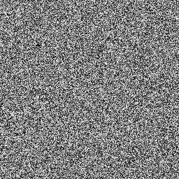

### 👋 Favourite daily quotes from [readwise.io/@louis](https://readwise.io/@louis)

          That is to say; there is nothing without other things. That is to say; there is no "thing-in-itself."
        

The Will to Power

Friedrich Wilhelm Nietzsche

          He understands good, the state of goodness, as something which promotes health.
        

The Antichrist

Friedrich Wilhelm Nietzsche

          How is it that we have more slaves today than we did during Roman times?
        

Skin_In_The_Game

louis.beaumont@gmail.com

### 🧠 Latest changes on [brain.louis030195.com](https://brain.louis030195.com)

    
    

        
            <ul>
                    <li>Philosophy/Human Society/Fuck you privacy.md</li>
                    <li>Philosophy/Mind/Mind.md</li>
            </ul>
        
        

            

                
brain upload 2021-07-18 20:36:28

            

        

    

    

    

        
            <ul>
                    <li>Philosophy/Mind/Mind.md</li>
            </ul>
        
        

            

                
brain upload 2021-07-18 20:06:28

            

        

    

    

    

        
            <ul>
                    <li>Excalidraw/Drawing 2021-07-18 18.17.41.excalidraw</li>
                    <li>Excalidraw/Drawing 2021-07-18 18.17.41.svg</li>
            </ul>
        
        

            

                
brain upload 2021-07-18 18:36:28

            

        

    

    

#### 🤔

Hi, I'm Louis, I do a lot of software bricolage,
[book reading](https://www.goodreads.com/user/show/103091881-louis-beaumont),
writing and thinking.
I enjoy learning every day about philosophy, fundamental sciences, compound knowledge and everything around software 2.0 and "AI".

- General activities automatically updated - [louis030195.com](https://louis030195.com)
- My second brain - [brain.louis030195.com](https://brain.louis030195.com)

Now, I am founder/co-founder of:
- [langa.me](https://langa.me)
- Software 2.0, GPT3+, based marketing-area startup

#### 📚 What I'm currently reading

-   **Henri Poincaré**  - [Science and Method](https://www.goodreads.com/book/show/1016008.Science_and_Method) - Mon Jul 12 06:47:53 -0700 2021
-   **G.H. Hardy**  - [A Mathematician&#39;s Apology](https://www.goodreads.com/book/show/154060.A_Mathematician_s_Apology) - Wed Jul 07 14:04:04 -0700 2021
-   **Sigmund Freud**  - [The Psychopathology of Everyday Life](https://www.goodreads.com/book/show/132449.The_Psychopathology_of_Everyday_Life) - Mon Jul 05 02:19:55 -0700 2021
-   **Judea Pearl**  - [Causality: Models, Reasoning, and Inference](https://www.goodreads.com/book/show/174276.Causality) - Thu Jun 10 01:23:21 -0700 2021
-   **Marcus Tullius Cicero**  - [On the Good Life](https://www.goodreads.com/book/show/84597.On_the_Good_Life) - Fri May 28 00:21:07 -0700 2021

#### ✍ My latest Goodreads reviews

-   **Edgar Morin**  - [Introduction à la pensée complexe](https://www.goodreads.com/book/show/1768368.Introduction_la_pens_e_complexe) - 4/5 - Wed Jul 07 14:03:04 -0700 2021
-   **David Hume**  - [An Enquiry Concerning Human Understanding](https://www.goodreads.com/book/show/130119.An_Enquiry_Concerning_Human_Understanding) - 4/5 - Sun Jul 04 11:17:59 -0700 2021
-   **Bertrand Russell**  - [A History of Western Philosophy](https://www.goodreads.com/book/show/243685.A_History_of_Western_Philosophy) - 5/5 - Sun Jul 04 03:22:31 -0700 2021
-   **Henri Poincaré**  - [Science and Hypothesis](https://www.goodreads.com/book/show/1016007.Science_and_Hypothesis) - 5/5 - Mon Jun 28 12:31:24 -0700 2021
-   **George S. Clason**  - [Babylyonin Miga Periya Panakaran](https://www.goodreads.com/book/show/37060336-babylyonin-miga-periya-panakaran) - 4/5 - Thu Jun 03 13:36:39 -0700 2021

#### 🗒 Medium posts

- [What you do not learn at school: how to learn](https://louis030195.medium.com/what-you-do-not-learn-at-school-how-to-learn-d6809922cac?source=rss-f1c331c9f256------2) - 5 months ago
- [The best breakfast is a delightful book](https://louis030195.medium.com/the-best-breakfast-is-a-delightful-book-fa7f6962b202?source=rss-f1c331c9f256------2) - 6 months ago
- [A simulation of evolution — Two](https://louis030195.medium.com/a-simulation-of-evolution-two-b26664d159a5?source=rss-f1c331c9f256------2) - 11 months ago
- [A Simulation of Evolution — Part One](https://medium.com/swlh/a-simulation-of-evolution-part-one-62a1acfb009a?source=rss-f1c331c9f256------2) - 1 year ago
- [Krishnamurti — Total Freedom, a review](https://louis030195.medium.com/krishnamurti-total-freedom-a-review-6c0a9821be8e?source=rss-f1c331c9f256------2) - 2 years ago

#### 🎬 Youtube Videos

- [Langame - Red Queen Effect](https://www.youtube.com/watch?v=wmwRHWftAj8) - 3 weeks ago
- [Langame - Gains from disorder](https://www.youtube.com/watch?v=URLHBGbsAeI) - 1 month ago
- [Noise - Aphantasia](https://www.youtube.com/watch?v=0gJo51xeiMU) - 1 month ago
- [Langame - Evolution of the species](https://www.youtube.com/watch?v=a2hD0XsK5iA) - 2 months ago
- [Niwrad 0.1.0](https://www.youtube.com/watch?v=K7mC-cQ5uwk) - 7 months ago

#### 🌱 My latest projects

- [louis030195/readwise-to-obsidian-action](https://github.com/louis030195/readwise-to-obsidian-action) - TODO: GitHub action that fetch all tagged Readwise highlights and push to Obsidian vault
- [louis030195/helm-charts](https://github.com/louis030195/helm-charts) - Cloud native Helm charts for Kubernetes, including Nakama game server
- [louis030195/big-talks](https://github.com/louis030195/big-talks) - Collaborative list of questions to trigger interesting conversations, thinking ... and, obviously, avoid small talks.
- [louis030195/Meme](https://github.com/louis030195/Meme) - Learning and teaching meme(s) one commit at a time.
- [louis030195/mineflayer-k8s](https://github.com/louis030195/mineflayer-k8s) - A generalist Mineflayer bot runnable on Kubernetes

#### 🔭 Latest releases I've contributed to

- [muesli/markscribe](https://github.com/muesli/markscribe) ([v0.6.0](https://github.com/muesli/markscribe/releases/tag/v0.6.0), 3 weeks ago) - Your personal markdown scribe with template-engine and Git(Hub) &amp; RSS powers 📜
- [louis030195/helm-charts](https://github.com/louis030195/helm-charts) ([nakama-0.1.3](https://github.com/louis030195/helm-charts/releases/tag/nakama-0.1.3), 3 months ago) - Cloud native Helm charts for Kubernetes, including Nakama game server
- [EleutherAI/gpt-neo](https://github.com/EleutherAI/gpt-neo) ([v1.0](https://github.com/EleutherAI/gpt-neo/releases/tag/v1.0), 4 months ago) - An implementation of model parallel GPT-2 and GPT-3-style models using the mesh-tensorflow library.
- [louis030195/niwrad](https://github.com/louis030195/niwrad) ([0.1.0](https://github.com/louis030195/niwrad/releases/tag/0.1.0), 7 months ago) - Distributed multiplayer sandbox evolution simulation
- [PrismarineJS/flying-squid](https://github.com/PrismarineJS/flying-squid) ([1.3.2](https://github.com/PrismarineJS/flying-squid/releases/tag/1.3.2), 8 months ago) - Create Minecraft servers with a powerful, stable, and high level JavaScript API.

#### 🔗 Links

